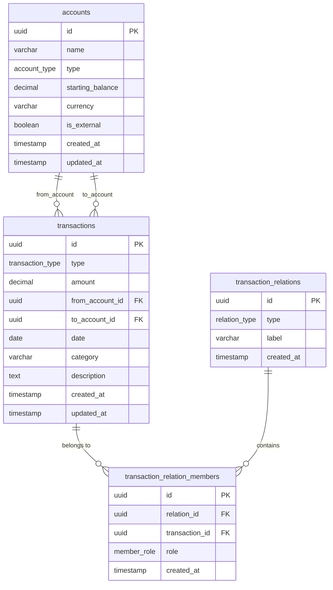

# Database Schema — Finance Tracker

_Designed for: EPIC-02 (Core Transaction Tracking MVP)_
_Stack: PostgreSQL 16, TypeORM ^0.3.x_

## Entity-Relationship Diagram



## Enums

```sql
CREATE TYPE account_type AS ENUM ('bank', 'cash', 'paypal', 'person', 'other');
CREATE TYPE transaction_type AS ENUM ('expense', 'income', 'transfer');
CREATE TYPE relation_type AS ENUM ('transfer_pair', 'group');
CREATE TYPE member_role AS ENUM ('outgoing', 'incoming', 'member');
```

## Tables

### `accounts`

Represents a financial account owned by the user, or an external entity (person/business) for transfer tracking.

| Column | Type | Constraints | Description |
|--------|------|-------------|-------------|
| `id` | UUID | PK, default `gen_random_uuid()` | Primary key |
| `name` | VARCHAR(100) | NOT NULL | Display name (e.g. "Sparkasse", "Cash", "Bob") |
| `type` | `account_type` | NOT NULL, default `'bank'` | Account category |
| `starting_balance` | DECIMAL(12,2) | NOT NULL, default `0.00` | Balance before first tracked transaction |
| `currency` | VARCHAR(3) | NOT NULL, default `'EUR'` | ISO 4217 code (no multi-currency math in MVP) |
| `is_external` | BOOLEAN | NOT NULL, default `false` | True for people/entities (not user-owned accounts) |
| `created_at` | TIMESTAMPTZ | NOT NULL, default `NOW()` | Row creation time |
| `updated_at` | TIMESTAMPTZ | NOT NULL, default `NOW()` | Last update time |

**Indexes:**
- `idx_accounts_type` on `(type)`
- `idx_accounts_is_external` on `(is_external)`

---

### `transactions`

A single financial event: money in, money out, or money moved.

| Column | Type | Constraints | Description |
|--------|------|-------------|-------------|
| `id` | UUID | PK, default `gen_random_uuid()` | Primary key |
| `type` | `transaction_type` | NOT NULL | One of: expense, income, transfer |
| `amount` | DECIMAL(12,2) | NOT NULL, CHECK > 0 | Always stored positive |
| `from_account_id` | UUID | FK → accounts(id), nullable | Source account (required for expense & transfer) |
| `to_account_id` | UUID | FK → accounts(id), nullable | Destination account (required for income & transfer) |
| `date` | DATE | NOT NULL | When the transaction occurred |
| `category` | VARCHAR(50) | nullable | Category label (preset list, no FK for MVP) |
| `description` | TEXT | nullable | Free-text note |
| `created_at` | TIMESTAMPTZ | NOT NULL, default `NOW()` | Row creation time |
| `updated_at` | TIMESTAMPTZ | NOT NULL, default `NOW()` | Last update time |

**Constraints:**
```sql
-- Enforce account rules per transaction type
ALTER TABLE transactions ADD CONSTRAINT chk_transaction_accounts CHECK (
  CASE type
    WHEN 'expense'  THEN from_account_id IS NOT NULL AND to_account_id IS NULL
    WHEN 'income'   THEN to_account_id IS NOT NULL AND from_account_id IS NULL
    WHEN 'transfer' THEN from_account_id IS NOT NULL AND to_account_id IS NOT NULL
  END
);

-- Amount must be positive (sign is determined by type + direction)
ALTER TABLE transactions ADD CONSTRAINT chk_amount_positive CHECK (amount > 0);
```

**Indexes:**
- `idx_transactions_date` on `(date)`
- `idx_transactions_type` on `(type)`
- `idx_transactions_from_account` on `(from_account_id)` WHERE from_account_id IS NOT NULL
- `idx_transactions_to_account` on `(to_account_id)` WHERE to_account_id IS NOT NULL
- `idx_transactions_category` on `(category)` WHERE category IS NOT NULL

---

### `transaction_relations`

A logical grouping that links multiple transactions together.

| Column | Type | Constraints | Description |
|--------|------|-------------|-------------|
| `id` | UUID | PK, default `gen_random_uuid()` | Primary key |
| `type` | `relation_type` | NOT NULL | `transfer_pair` or `group` |
| `label` | VARCHAR(100) | nullable | Human-readable label (required for groups, optional for pairs) |
| `created_at` | TIMESTAMPTZ | NOT NULL, default `NOW()` | Row creation time |

---

### `transaction_relation_members`

Junction table linking transactions to their relation.

| Column | Type | Constraints | Description |
|--------|------|-------------|-------------|
| `id` | UUID | PK, default `gen_random_uuid()` | Primary key |
| `relation_id` | UUID | FK → transaction_relations(id), NOT NULL, ON DELETE CASCADE | The relation this membership belongs to |
| `transaction_id` | UUID | FK → transactions(id), NOT NULL, ON DELETE CASCADE | The linked transaction |
| `role` | `member_role` | NOT NULL | `outgoing`/`incoming` for pairs; `member` for groups |
| `created_at` | TIMESTAMPTZ | NOT NULL, default `NOW()` | Row creation time |

**Constraints:**
```sql
-- Each transaction appears at most once per relation
ALTER TABLE transaction_relation_members
  ADD CONSTRAINT uq_relation_transaction UNIQUE (relation_id, transaction_id);

-- Transfer pairs must have at most 2 members
-- (enforced at application layer — DB allows insert then validates)
```

**Indexes:**
- `idx_trm_relation` on `(relation_id)`
- `idx_trm_transaction` on `(transaction_id)`

---

## Key Queries (reference for implementers)

### Current balance per account

```sql
SELECT
  a.id,
  a.name,
  a.starting_balance
    + COALESCE(SUM(CASE WHEN t.to_account_id = a.id THEN t.amount ELSE 0 END), 0)
    - COALESCE(SUM(CASE WHEN t.from_account_id = a.id THEN t.amount ELSE 0 END), 0)
  AS current_balance
FROM accounts a
LEFT JOIN transactions t
  ON t.from_account_id = a.id OR t.to_account_id = a.id
WHERE a.is_external = false
GROUP BY a.id;
```

### Outstanding transfers (unmatched pair legs)

```sql
SELECT tr.id AS relation_id, t.*
FROM transaction_relations tr
JOIN transaction_relation_members trm ON trm.relation_id = tr.id
JOIN transactions t ON t.id = trm.transaction_id
WHERE tr.type = 'transfer_pair'
GROUP BY tr.id, t.id
HAVING COUNT(*) OVER (PARTITION BY tr.id) = 1;
```

_Simpler approach used in API: find all `transfer_pair` relations that have exactly 1 member._

### Monthly totals (excluding transfers from income/expense sums)

```sql
SELECT
  DATE_TRUNC('month', t.date) AS month,
  SUM(CASE WHEN t.type = 'income' THEN t.amount ELSE 0 END) AS total_income,
  SUM(CASE WHEN t.type = 'expense' THEN t.amount ELSE 0 END) AS total_expenses,
  SUM(CASE WHEN t.type = 'transfer' THEN t.amount ELSE 0 END) AS total_transfers
FROM transactions t
GROUP BY DATE_TRUNC('month', t.date)
ORDER BY month DESC;
```

## Design Decisions

1. **Amount is always positive** — direction is encoded by `type` + which account column is populated. This avoids ambiguity and simplifies summation.

2. **External accounts as accounts** — People/entities (e.g. "Bob") are modeled as accounts with `is_external = true`. This lets transfers to/from people reuse the same FK pattern without a separate "contacts" table.

3. **Flexible relations** — Rather than a direct `linked_transaction_id` column, we use a junction table (`transaction_relation_members`) that supports both 2-member pairs and N-member groups with a single structure.

4. **Outstanding detection** — A transfer pair relation with only 1 member = outstanding. When the return leg is logged and linked, the pair becomes complete. This is queried, not stored as a flag (single source of truth).

5. **Category as VARCHAR** — For MVP, categories are free-text from a preset list (no separate table). This will be normalized in a future epic if needed.

6. **No soft deletes for MVP** — Hard delete with CASCADE on relation members. Audit trail is a future concern.
